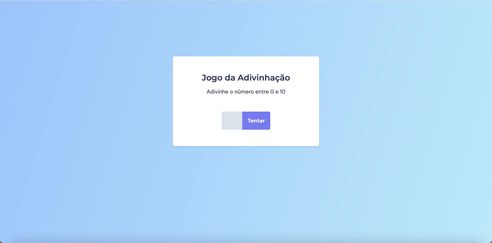

<h1 align="center"> Projeto - Jogo da Adivinhação</h1>

Hora de colocar em prática o que foi ensinado na primeira fase do stage 05 e o que foi visto nos stages anteriores.

  <a href="#-tecnologias">Tecnologias</a>&nbsp;&nbsp;&nbsp;|&nbsp;&nbsp;&nbsp;
  <a href="#-projeto">Projeto</a>&nbsp;&nbsp;&nbsp;|&nbsp;&nbsp;&nbsp;
  <a href="#-layout">Layout</a>&nbsp;&nbsp;&nbsp;|&nbsp;&nbsp;&nbsp;

  

 

## 🚀 Tecnologias

Esse projeto foi desenvolvido com as seguintes tecnologias:

&nbsp;
&nbsp;
&nbsp;

## 💻 Projeto

É um projeto chamado Jogo da Adivinhação, no qual o usuário deve acertar um número aleatório de 0 a 10 escolhido pela aplicação.

## 🔖 Layout do projeto

 
 

Link do Figma:
 
https://www.figma.com/file/9TqCEbEQDbWCPijcgv57y2/Jogo-Adivinha%C3%A7%C3%A3o-Copy?fuid=862035319941794750

 

## Aprendizado

- Estrutura de dados HTML;
- Estilos com CSS;
- Funções no Javascript;
- Manipulação da DOM;
- Biblioteca JS Math();
- Funções _callback_;

 
 

🚀 by Paulo Henrique A. Stabelino.
